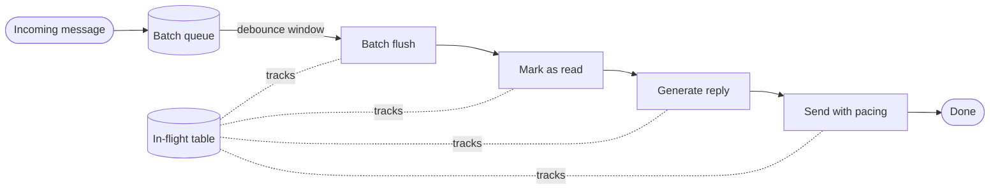
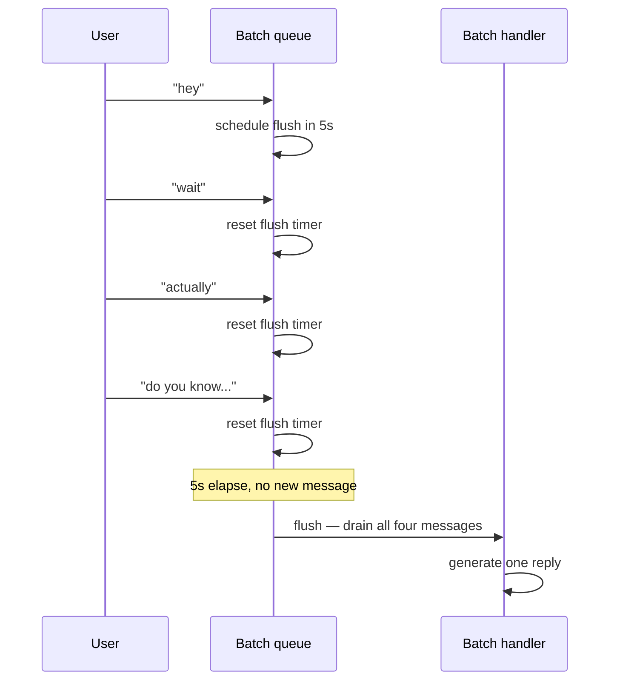
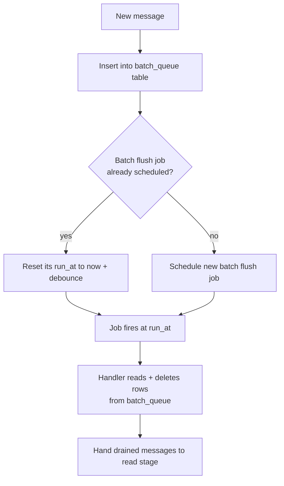
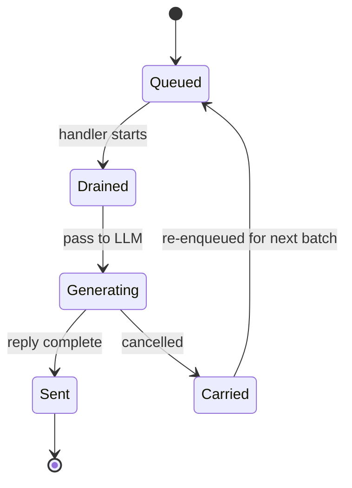
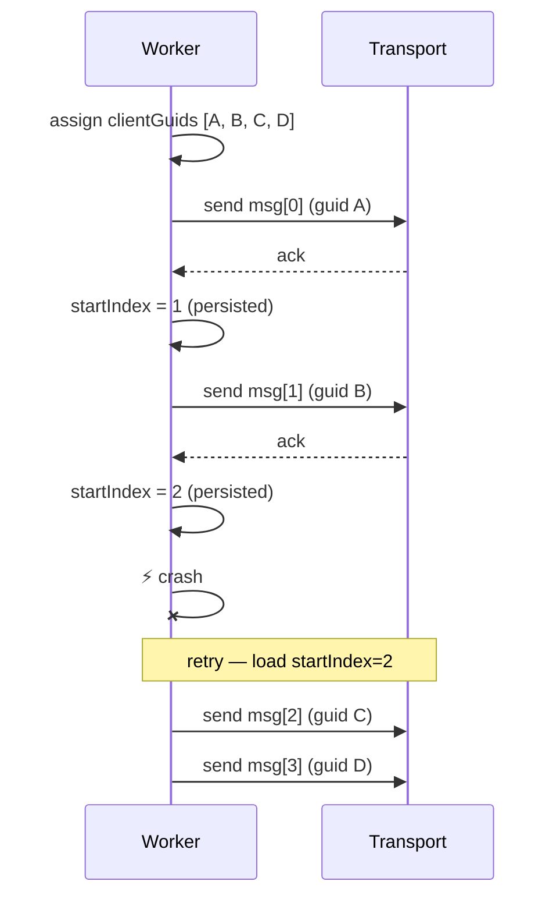
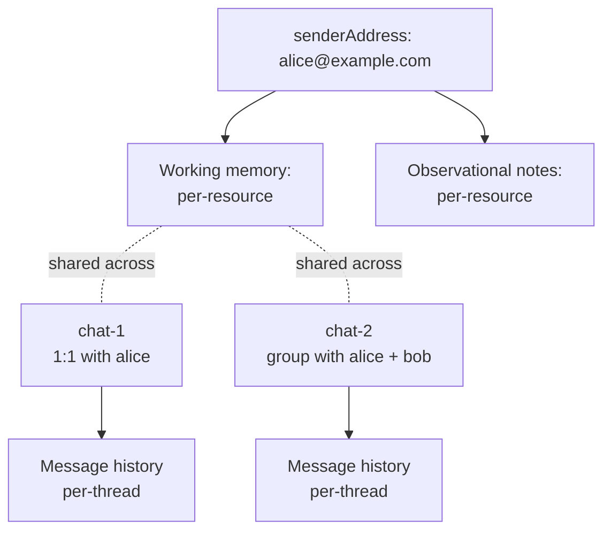
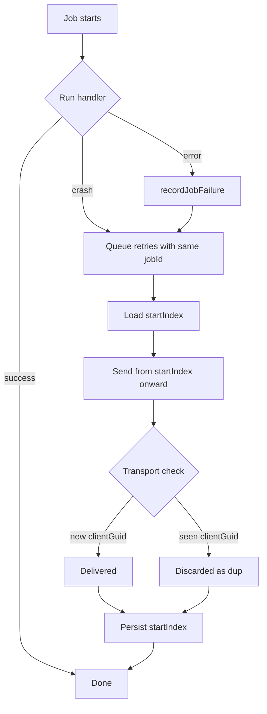

# Spectrum

[`spectrum-ts`](https://github.com/photon-hq/spectrum-ts) is Photon's unified messaging SDK for TypeScript. Write your handler logic once against a single `app.messages` stream and deliver it across every platform — iMessage, WhatsApp Business, your terminal, or a custom platform you build yourself.

This skill is a complete, source-accurate reference: core API, every built-in provider, custom platform authoring, and the production architecture patterns Photon uses internally to ship agents that **live natively inside IM apps**.

> Spectrum is in early preview. APIs may change between releases.

---

## Installation

```bash
npm install spectrum-ts        # or pnpm / yarn / bun add
```

Requires TypeScript 5 or later.

## Core concepts

Four primitives:

| Primitive | What it represents |
|---|---|
| **Message** | An incoming piece of content — text, attachments, or structured data — from any platform. |
| **Space** | A conversation context. A DM, a group chat, a terminal session. You send messages *into* a space. |
| **User** | A participant on a platform, identified by a platform-specific ID. |
| **Platform provider** | A platform adapter (iMessage, terminal, WhatsApp, or your own) that translates platform-specific protocols into Spectrum's unified interface. |

Every message arrives as a `[Space, Message]` tuple. The space gives you the ability to respond; the message gives you the content and metadata.

## Quickstart

Find `PROJECT_ID` and `SECRET_KEY` in your project **Settings** on the [dashboard](https://app.photon.codes/).

```ts
import { Spectrum } from "spectrum-ts";
import { imessage } from "spectrum-ts/providers/imessage";

const app = await Spectrum({
  projectId: "your-project-id",
  projectSecret: "your-project-secret",
  providers: [imessage.config()],
});

for await (const [space, message] of app.messages) {
  if (message.content.type === "text") {
    await space.send(`echo: ${message.content.text}`);
  }
}
```

Projectless providers like `terminal` work without credentials:

```ts
import { Spectrum } from "spectrum-ts";
import { terminal } from "spectrum-ts/providers/terminal";

const app = await Spectrum({ providers: [terminal.config()] });
```

## The app instance

`Spectrum()` returns an object that merges a message stream with platform-specific custom event streams.

```ts
app.messages                 // AsyncIterable<[Space, Message]>
await app.send(space, ...)   // send into a space
await app.responding(space, fn)  // run fn with a typing indicator
await app.stop()             // graceful shutdown
```

## Multi-platform in three lines

Combine providers — `app.messages` merges every source into one stream. The `message.platform` field identifies the origin.

```ts
import { Spectrum } from "spectrum-ts";
import { imessage } from "spectrum-ts/providers/imessage";
import { terminal } from "spectrum-ts/providers/terminal";
import { whatsappBusiness } from "spectrum-ts/providers/whatsapp-business";

const app = await Spectrum({
  projectId: process.env.PROJECT_ID!,
  projectSecret: process.env.PROJECT_SECRET!,
  providers: [
    imessage.config(),
    whatsappBusiness.config({
      accessToken: process.env.WA_TOKEN!,
      phoneNumberId: process.env.WA_NUMBER_ID!,
      appSecret: process.env.WA_SECRET!,
    }),
    terminal.config(),
  ],
});

for await (const [space, message] of app.messages) {
  await space.responding(async () => {
    await message.reply("Hello from Spectrum.");
  });
}
```

---

## Messages

Every incoming message arrives through `app.messages` as a `[Space, Message]` tuple. The space is already bound to the originating conversation — you don't need to resolve it yourself to reply.

### The Message shape

| Field | Description |
|---|---|
| `id` | Platform-assigned message identifier. |
| `content` | Discriminated union on `type` — see [Narrowing content](#narrowing-content). |
| `sender` | The `User` who sent the message (`{ id, __platform }`). |
| `space` | The `Space` the message was sent into. |
| `platform` | Name of the provider that delivered the message (e.g. `"iMessage"`, `"terminal"`). |
| `timestamp` | `Date` of when the message was sent. |
| `react(reaction)` | React to this message. No-op on platforms without reactions. |
| `reply(...content)` | Reply threaded to this message. No-op on platforms without thread support. |

### Narrowing content

`Content` is a discriminated union. Always narrow on `message.content.type` before accessing fields.

```ts
for await (const [space, message] of app.messages) {
  switch (message.content.type) {
    case "text":
      console.log(message.content.text);
      break;
    case "attachment":
      console.log(
        `${message.content.name} (${message.content.mimeType})`,
        await message.content.read(),
      );
      break;
    case "voice":
      console.log(`voice note (${message.content.duration}s)`);
      break;
    case "contact":
      console.log(message.content.name?.formatted, message.content.phones);
      break;
    case "richlink":
      console.log(message.content.url, await message.content.title());
      break;
    case "reaction":
      console.log(`${message.content.emoji} on ${message.content.target.id}`);
      break;
    case "poll":
      console.log(message.content.title, message.content.options);
      break;
    case "poll_option":
      console.log(`vote ${message.content.selected ? "+" : "-"}`, message.content.title);
      break;
    case "group":
      console.log(`group of ${message.content.items.length} items`);
      break;
    case "custom":
      console.log(message.content.raw);
      break;
  }
}
```

| Type | Fields |
|---|---|
| `"text"` | `text: string` |
| `"attachment"` | `name`, `mimeType`, `size?`, `read()`, `stream()` |
| `"voice"` | `name?`, `mimeType`, `duration?`, `size?`, `read()`, `stream()` |
| `"contact"` | `name?`, `phones?`, `emails?`, `addresses?`, `org?`, `urls?`, `birthday?`, `note?`, `photo?`, `user?` |
| `"richlink"` | `url`, `title()`, `summary()`, `cover()` |
| `"reaction"` | `emoji`, `target: Message` |
| `"poll"` | `title`, `options: { title: string }[]` |
| `"poll_option"` | `option`, `poll`, `selected: boolean`, `title` — sent as a vote |
| `"group"` | `items: Message[]` — bundled multi-message unit |
| `"custom"` | `raw: unknown` — platform-specific structured data |

Outgoing-only variants like `"effect"` (an iMessage screen effect wrapping inner content) appear on echoed sends — see [iMessage](#imessage) for the builder.

### Filtering out your own messages

Some platforms echo your own sends. Compare the sender to a known identity:

```ts
for await (const [space, message] of app.messages) {
  if (message.sender.id === myAccountId) continue;
}
```

iMessage exposes an `isFromMe` flag on the raw message extra (via `message.schema`).

### Acting on a message

```ts
await message.react("love");              // react
await message.reply("Got it");            // threaded reply
await space.send("Here's more context");  // fresh send into the space
```

---

## Content builders

Every `send`/`reply` accepts a plain string or a `ContentBuilder`. Builders: `text`, `attachment`, `voice`, `contact`, `richlink`, `poll`, `option`, `group`, `custom`.

### Text

```ts
import { text } from "spectrum-ts";

await space.send(text("Hello, world."));
await space.send("Hello, world."); // strings are equivalent
```

### Attachments

Pass a file path or a `Buffer`. MIME types are inferred from the file extension; override with `options.mimeType` when you have raw bytes.

```ts
import { attachment } from "spectrum-ts";

await space.send(attachment("/path/to/photo.jpg"));
await space.send(attachment(buffer, { name: "report.pdf", mimeType: "application/pdf" }));
```

If MIME type can't be inferred and `options.mimeType` is omitted, the builder throws at build time.

### Voice

Same input shape as `attachment`, plus optional `duration` for waveform UIs.

```ts
import { voice } from "spectrum-ts";

await space.send(voice("/path/to/note.m4a"));
await space.send(voice(buffer, { name: "note.m4a", mimeType: "audio/mp4", duration: 12 }));
```

Platforms that don't support voice notes downgrade to a regular audio attachment.

### Contacts

Accepts a structured `ContactInput`, a vCard string, a `vcf` instance, or a `User` plus optional details.

```ts
import { contact, fromVCard } from "spectrum-ts";

await space.send(contact({
  name: { first: "Ada", last: "Lovelace" },
  phones: [{ value: "+15551234567", type: "mobile" }],
}));

// From a User
await space.send(contact(alice, { org: { name: "Acme", title: "Engineer" } }));

// From vCard
const vcf = await readFile("/path/to/ada.vcf", "utf8");
await space.send(contact(vcf));
const parsed = fromVCard(vcf);
await space.send(contact({ ...parsed, note: "Met at conference" }));
```

`fromVCard` parses; `toVCard` serializes a resolved `Contact` back.

### Rich links

Spectrum scrapes Open Graph metadata at send time:

```ts
import { richlink } from "spectrum-ts";

await space.send(richlink("https://example.com/article"));
```

`title()`, `summary()`, `cover()` are lazy — fetched only if the receiving platform needs them. Platforms without rich-link support fall back to plain text.

### Polls

```ts
import { poll, option } from "spectrum-ts";

await space.send(poll("Lunch?", "Pizza", "Sushi", "Tacos"));
await space.send(poll("Lunch?", [option("Pizza"), option("Sushi")]));
```

Poll responses arrive as `poll_option` content.

### Groups

`group()` bundles multiple messages into one logical unit (an album, a multi-attachment reply). Each item is delivered as its own `Message` but ships together.

```ts
import { group, attachment } from "spectrum-ts";

await space.send(group(
  attachment("/path/to/photo-1.jpg"),
  attachment("/path/to/photo-2.jpg"),
));
```

Groups don't nest, and reactions can't be group members — both enforced at construction. Platforms without grouping fall back to sending each item sequentially.

### Custom

Send platform-specific structured payloads:

```ts
import { custom } from "spectrum-ts";

await space.send(custom({ type: "card", title: "Order Confirmed" }));
```

The provider's `actions.send` interprets `raw`.

### Composing multiple items

```ts
await space.send("Here's the file:", attachment("/path/to/document.pdf"));
```

Items are sent as separate messages (one `send()` per item). Use `group(...)` when you specifically want a single bundled unit.

---

## Spaces and users

A **space** is a conversation. A **user** is a participant. Both carry a `__platform` tag.

### Space interface

| Method | Description |
|---|---|
| `send(...content)` | Send one or more content items. |
| `startTyping()` / `stopTyping()` | Show / hide typing indicator. No-op without support. |
| `responding(fn)` | Run `fn` wrapped in typing — guarantees indicator is cleared even on throw. |
| `edit(message, newContent)` | Edit a previously sent message. |
| `getMessage(id)` | Look up a message by ID. |

### Typing indicators

`responding` is the recommended pattern:

```ts
await space.responding(async () => {
  const result = await generateResponse(message);
  await space.send(result);
});
```

Or via the app helper: `await app.responding(space, async () => { ... })`.

### Creating a space

Use [platform narrowing](#platform-narrowing) for the platform instance, then pass users:

```ts
import { imessage } from "spectrum-ts/providers/imessage";

const im = imessage(app);
const alice = await im.user("+15551111111");
const bob = await im.user("+15552222222");

const dm = await im.space(alice);
const group = await im.space(alice, bob);

await group.send("Welcome to the group.");
```

The returned space satisfies the generic `Space` interface and carries platform-specific fields (e.g. `type: "dm" | "group"` on iMessage).

---

## Reactions and replies

Both live directly on an incoming message. Both no-op silently on platforms that don't support them — no `try/catch` needed.

```ts
await message.react("love");
await message.reply("Replying to your message.");
await message.reply("Here's the file:", attachment("/path/to/file.pdf"));
```

On platforms with thread support (iMessage, WhatsApp Business), `reply` sends threaded. **It is not downgraded to a regular send** — if you need guaranteed delivery, use `space.send(...)`.

| Want to | Use |
|---|---|
| Send fresh content into a conversation | `space.send(...)` |
| Reply in-thread to a specific message | `message.reply(...)` |
| React to a specific message | `message.react(reaction)` |

---

## Platform narrowing

Every provider exports a callable — `imessage`, `terminal`, `whatsappBusiness` — that **narrows** generic Spectrum types into platform-specific ones. The same function handles three inputs:

```ts
import { imessage } from "spectrum-ts/providers/imessage";

// 1. Narrow the app — get user/space resolvers and custom events
const im = imessage(app);
const user = await im.user("+15551234567");
const space = await im.space(user);

// 2. Narrow a space — access platform-specific fields
for await (const [space, message] of app.messages) {
  if (message.platform !== "iMessage") continue;
  const imSpace = imessage(space);
  if (imSpace.type === "group") { /* ... */ }
}

// 3. Narrow a message — exposes provider's `message.schema` extras
const imMessage = imessage(message);
```

If the platform isn't registered in `providers`, `imessage(app)` resolves to `never` (compile-time error). Narrowing a space/message from the wrong platform throws at runtime — gate on `message.platform` first.

---

## Built-in providers

| Provider | Notes |
|---|---|
| **iMessage** | Cloud, local, and dedicated modes. Tapbacks, typing, threaded replies, DMs, groups, message effects. |
| **Terminal** | TUI test harness — drag-and-drop attachments, inline images, multi-chat sidebar. Zero config. |
| **WhatsApp Business** | Official Cloud API. Native reactions and replies. **1:1 only** — no group management. |

### iMessage

```ts
import { imessage } from "spectrum-ts/providers/imessage";
```

Three modes:

```ts
// Cloud (default) — managed by Spectrum, full feature set
imessage.config();

// Local — reads macOS Messages SQLite directly. No network.
// Only supports text + attachments. No reactions, typing, replies, or group creation.
imessage.config({ local: true });

// Dedicated — connect to your own iMessage gRPC endpoints
imessage.config({
  clients: [
    { address: "instance-1.example.com:443", token: "your-token", phone: "+15551111111" },
    { address: "instance-2.example.com:443", token: "your-token", phone: "+15552222222" },
  ],
});
```

Cloud mode renews tokens automatically at 80% of TTL and requires `projectId` and `projectSecret` on `Spectrum()`. Multiple dedicated clients route messages by phone number.

#### Line model (cloud mode)

| Plan | Line allocation | What end users see |
|---|---|---|
| **Free / Pro** | Shared pool — each end user routed through a different number from a shared pool | Normal iMessage from a number that may differ across recipients |
| **Business** | Dedicated — all end users text the same number, which belongs to your project | Normal iMessage, always from the same number |

**Auto-scale** is an opt-in Business feature: when traffic to a dedicated line nears its per-line capacity, Spectrum provisions an additional line. Open-source paths (`local: true` or your own dedicated relay) provide their own iCloud account; managed-line concepts don't apply.

#### Space types and per-phone routing

iMessage spaces carry `type: "dm" | "group"` and a `phone` field. With multiple dedicated lines, pin a conversation to a specific line:

```ts
const dm = await im.space(alice, { phone: "+15559999999" });
```

When omitted, Spectrum picks at random from available dedicated lines. Per-phone routing applies to **dedicated lines (Business plan) only**; on shared-pool plans the parameter is ignored. Space creation requires cloud or dedicated mode — local mode throws.

#### Message effects

Wrap any content with `effect()`. Wrapped content can be a string or `attachment(...)`. Effects only apply on iMessage; other platforms see the inner content unchanged.

```ts
import { effect, imessage } from "spectrum-ts/providers/imessage";

await space.send(effect("Happy birthday!", imessage.effect.message.celebration));
await space.send(effect(attachment("/path/to/photo.jpg"), imessage.effect.message.confetti));
```

| Bubble effects | |
|---|---|
| `imessage.effect.message.slam` | `"com.apple.MobileSMS.expressivesend.impact"` |
| `imessage.effect.message.loud` | `"com.apple.MobileSMS.expressivesend.loud"` |
| `imessage.effect.message.gentle` | `"com.apple.MobileSMS.expressivesend.gentle"` |
| `imessage.effect.message.invisible` | `"com.apple.MobileSMS.expressivesend.invisibleink"` |

| Screen effects | |
|---|---|
| `imessage.effect.message.confetti` | `"com.apple.messages.effect.CKConfettiEffect"` |
| `imessage.effect.message.fireworks` | `"com.apple.messages.effect.CKFireworksEffect"` |
| `imessage.effect.message.balloons` | `"com.apple.messages.effect.CKBalloonEffect"` |
| `imessage.effect.message.heart` | `"com.apple.messages.effect.CKHeartEffect"` |
| `imessage.effect.message.lasers` | `"com.apple.messages.effect.CKLasersEffect"` |
| `imessage.effect.message.celebration` | `"com.apple.messages.effect.CKHappyBirthdayEffect"` |
| `imessage.effect.message.sparkles` | `"com.apple.messages.effect.CKSparklesEffect"` |
| `imessage.effect.message.spotlight` | `"com.apple.messages.effect.CKSpotlightEffect"` |
| `imessage.effect.message.echo` | `"com.apple.messages.effect.CKEchoEffect"` |

#### Tapback constants

| Constant | Value |
|---|---|
| `imessage.tapbacks.love` | `"love"` |
| `imessage.tapbacks.like` | `"like"` |
| `imessage.tapbacks.dislike` | `"dislike"` |
| `imessage.tapbacks.laugh` | `"laugh"` |
| `imessage.tapbacks.emphasize` | `"emphasize"` |
| `imessage.tapbacks.question` | `"question"` |

```ts
await message.react(imessage.tapbacks.laugh);
```

### Terminal

```ts
import { terminal } from "spectrum-ts/providers/terminal";
```

A full chat TUI for developing and testing agents locally. `terminal.config()` spawns the standalone [tuichat](https://github.com/photon-hq/tuichat) binary as a subprocess and drives it over JSON-RPC. The binary auto-downloads from GitHub Releases on first run. In a TTY it boots the rich UI; in a non-TTY context (CI, piped input) it falls back to a synchronous readline loop — same agent code works for scripted tests.

```ts
const app = await Spectrum({ providers: [terminal.config()] });
```

| Feature | How |
|---|---|
| Multiple chats | `Ctrl+N` opens a new chat, `Ctrl+J` / `Ctrl+K` switch. Each chat is its own space. |
| Reactions | Press `r` on a message — arrives as a `reaction` content message. |
| Replies | Press `e` — arrives with a `replyTo: { messageId }` extra. |
| File attachments | Drag-and-drop into the terminal. |
| Inline images | Kitty graphics protocol when supported, half-block fallback. |
| Typing indicators | `space.startTyping()` / `space.stopTyping()`. |
| Console capture | `console.log` / `info` / `warn` / `error` / `debug` are forwarded into a pinned `__system__` chat instead of garbling the UI. |

#### Slash commands

```ts
terminal.config({
  commands: [
    { name: "/clear", description: "Clear conversation memory" },
    { name: "/whoami", description: "Print sender details" },
  ],
});
```

Names must match `/^\/[A-Za-z0-9_-]+$/`. Slash commands arrive as regular text messages with the command string as the content.

#### Programmatic spaces

```ts
const t = terminal(app);
const debug = await t.space({ id: "debug" });
await debug.send("agent online");
```

Default is `chat-1`; new chats opened with `Ctrl+N` get `chat-2`, `chat-3`, ...

### WhatsApp Business

```ts
import { whatsappBusiness } from "spectrum-ts/providers/whatsapp-business";
```

Wraps the official WhatsApp Business Cloud API. **1:1 only** — `space(userA, userB)` throws.

```ts
whatsappBusiness.config({
  accessToken: "...",       // permanent or system-user token from Meta for Developers
  phoneNumberId: "...",     // sender phone number ID
  appSecret: "...",         // verifies webhook payload signatures
});
```

Resolve users by phone number (international format, digits only):

```ts
const wa = whatsappBusiness(app);
const customer = await wa.user("15551234567");
const space = await wa.space(customer);
await space.send("Thanks for reaching out.");
```

---

## Custom events and lifecycle

### Custom events

Providers can emit events beyond messages — typing, read receipts, delivery status, anything. Each is exposed as a flat async iterable on the app instance:

```ts
for await (const event of app.typing) {
  console.log(`${event.platform}: typing event received`);
}
```

The property name matches the event name the provider declared. Streams are created lazily on first access; subsequent iterations share the same source. Per-platform access is also available on a narrowed instance:

```ts
const im = imessage(app);
for await (const event of im.typing) { /* iMessage-only typing events */ }
```

### Graceful shutdown

```ts
await app.stop();
```

Closes the merged message stream, drains and disposes every custom event stream, and tears down every platform client via its `lifecycle.destroyClient` hook (if defined). Idempotent.

Spectrum registers `SIGINT` and `SIGTERM` handlers on startup. When a signal fires, `stop()` is invoked with a 3-second timeout — exit 0 if cleanup completes, exit 1 if not. You don't need to wire this up yourself.

Call `stop()` manually when:
- embedding Spectrum in a longer-running process and tearing it down without exiting
- writing tests that create and dispose an app per case
- you want deterministic cleanup before re-initializing with a different provider set

---

## Building a custom platform

`definePlatform` is the entry point. It takes a name and a definition object and returns a callable that exposes `.config()` for registration and accepts a Spectrum instance, space, or message for narrowing.

```ts
import { definePlatform } from "spectrum-ts";
import z from "zod";

export const myPlatform = definePlatform("my-platform", {
  config: z.object({ apiKey: z.string() }),

  user: {
    resolve: async ({ input, client }) => ({
      id: input.userID,
      displayName: await client.lookupUser(input.userID),
    }),
  },

  space: {
    resolve: async ({ input, client }) => ({
      id: await client.findOrCreateConversation(input.users.map(u => u.id)),
    }),
  },

  lifecycle: {
    createClient: async ({ config, store }) => new MyPlatformClient(config.apiKey),
    destroyClient: async ({ client }) => { await client.disconnect(); },
  },

  events: {
    async *messages({ client }) {
      for await (const msg of client.onMessage()) {
        yield {
          id: msg.id,
          content: { type: "text", text: msg.body },
          sender: { id: msg.authorId },
          space: { id: msg.channelId },
          timestamp: new Date(msg.ts),
        };
      }
    },
  },

  actions: {
    send: async ({ space, content, client }) => {
      if (content.type === "text") {
        await client.send(space.id, content.text);
      }
    },
    // Optional: startTyping, stopTyping, reactToMessage, replyToMessage, editMessage, getMessage
  },

  static: {
    reactions: { thumbsUp: "+1", thumbsDown: "-1" } as const,
  },
});
```

### Field reference

| Field | Required | Description |
|---|---|---|
| `config` | Yes | Zod schema validating `platform.config()` argument. If every field is optional, `.config()` can be called with no arguments. |
| `user.resolve` | Yes | Resolves a user from a string ID. Returns at minimum `{ id: string }`. |
| `user.schema` | No | Optional Zod schema for extra user properties. |
| `space.resolve` | Yes | Resolves or creates a conversation. Receives an array of users plus optional params. |
| `space.schema` | No | Optional Zod schema for the resolved space. |
| `space.params` | No | Zod schema for additional space creation parameters — surfaces as the second arg to `platform(app).space()`. |
| `lifecycle.createClient` | Yes | Creates the platform client. Receives `config`, `projectId`, `projectSecret` (both may be `undefined`), and `store`. |
| `lifecycle.destroyClient` | No | Tears down the client on shutdown. |
| `events.messages` | Yes | Async generator yielding incoming messages. |
| `events.[custom]` | No | Additional async generators for platform-specific events — exposed on `app.[eventName]`. |
| `actions.send` | Yes | Sends a single content item. Invoked once per item when multiple are passed. |
| `actions.startTyping` / `stopTyping` | No | Typing indicator. |
| `actions.reactToMessage` | No | Missing → `message.react(...)` becomes a no-op. |
| `actions.replyToMessage` | No | Missing → `message.reply(...)` becomes a no-op. |
| `actions.editMessage` / `getMessage` | No | Edit and message lookup. |
| `message.schema` | No | Zod schema for extra typed fields on incoming messages — surfaced through narrowing. |
| `static` | No | Constants attached to the platform object (e.g. tapback names). |

### Event producers

Every event generator receives `{ client, config, store }` and returns an `AsyncIterable`:

```ts
events: {
  async *messages({ client }) { /* ... */ },
  async *typing({ client }) {
    for await (const ev of client.typing()) {
      yield { spaceId: ev.chatId, userId: ev.user };
    }
  },
},
```

Non-`messages` events are auto-wired as flat properties on both `app` and the narrowed platform instance.

---

# Best practices: production agent patterns

These are the architecture patterns Photon uses internally to ship agents that **live natively inside IM apps**. They're pulled directly from production — the problems we hit and the solutions we built. If you're building a similar agent, these patterns will save you months of trial and error.

A naive Spectrum agent — read incoming, call the LLM, send the reply — falls apart in ways you don't see until you ship it. The user types "hey" → "wait" → "actually nvm" inside three seconds and gets three independent responses. The agent replies in 200ms when a real person would take five minutes. A worker crashes mid-send and the user receives the same message twice on retry. The patterns below solve those problems.

## The pipeline

Every incoming message flows through five stages backed by a job queue. Each stage is a separately enqueued job, which is what makes any of them cancellable when a follow-up message lands.



The `In-flight` table is a per-chat record of whichever job ID currently owns each stage. When a new message arrives, the enqueuer reads it, cancels those jobs, and moves any messages that were already drained into a carry-forward table so the next batch sees them.

### Why split it up

If you do everything in one handler — read, generate, send — you lose the ability to react to a new message that arrives during generation. By the time you notice, you've already sent a reply that ignored what the user just said, or you've raced the LLM against itself.

Splitting into stages costs a few hundred ms of extra hop latency and buys you:

- **Cancellation points.** Each stage can check a flag and abort cleanly.
- **Resume points.** A worker crash mid-stage retries one stage, not the whole conversation turn.
- **Idempotency seams.** The send stage carries stable client GUIDs so retries don't double-send.
- **Distinct timing.** The read stage can sleep for an hour while the send stage runs in 500ms — they're independent jobs.

## Inbound pipeline

People text in bursts. A real conversation looks like this:

```
hey
wait
actually
do you know if the train runs on holidays
```

Four messages in eight seconds. If your agent fires a generation on each one, you get four overlapping replies — and the model never sees the actual question. The fix is to debounce: wait a few seconds for the burst to settle, and handle whatever has accumulated as one turn.



A few seconds of fixed debounce gets you most of the way there. The harder problems are what happens after the flush.

### Drain in the handler, not the enqueuer

The single most important rule: **the messages stay in the queue table until the handler reads them.** Don't pull them into the job payload at enqueue time.

Why: if the batch-flush job gets cancelled before the handler runs, anything in the payload is lost. Anything still in the queue is naturally picked up by the next batch. Keeping the data in the queue table until the last possible moment makes cancellation a non-event for those messages.



If the flush job is cancelled between F and G, the rows stay in `batch_queue` and the next incoming message picks them up.

### Carry-forward

Sometimes the handler does drain the queue but is then cancelled mid-generation. Those messages are now in memory inside a cancelled job — they'd be lost on the floor.

The fix is a `carried_messages` table. When a job is cancelled after draining, write the drained messages there. The next batch's handler reads from `carried_messages` first and prepends them as `[Earlier message] ...` lines so the model sees them as historical context, not as fresh input.



### In-flight cancellation

When a new message arrives and you have a job in flight (reading, generating, or sending), you need to stop it. Two pieces:

1. **A cancellation flag** in a per-chat `in_flight` table. The enqueuer sets `cancelled_at` and calls `boss.cancel(jobId)`.
2. **Polling inside the handler.** The send stage in particular polls `cancelled_at` every 500ms and aborts via an `AbortController`.

The subtle bit: compare `cancelled_at` against the chain's own `chainStartedAt` timestamp, not against "is the flag set." Otherwise a stale flag from a prior cancelled chain orphans the new one. The flag is per-chain, not per-chat.

```ts
const inflight = await readInflight(chatId);
if (inflight?.cancelled_at && inflight.cancelled_at > chainStartedAt) {
  abortController.abort();
}
```

### What you give up

This pipeline buys you correctness at the cost of a few hundred milliseconds of hop latency between stages. For a conversational Spectrum agent that's irrelevant — humans don't notice 300ms when a real reply takes 5 seconds anyway. For a low-latency tool integration, you'd consolidate stages.

## Recovery and state

Workers crash. The send job fails halfway through a 4-message reply. The retry runs from the top — and the user gets messages 1 and 2 again, then 3 and 4 for the first time. Now they have a duplicate.

You need three things to make this robust: stable client GUIDs, a resume cursor, and a place to record what failed.

### Stable client GUIDs

Every message you enqueue gets a deterministic identifier — a `clientGuid` — assigned at enqueue time, not at send time. The transport uses it for deduplication: if it sees the same `clientGuid` twice, it discards the second copy.

```ts
const messages = reply.map((text, index) => ({
  text,
  clientGuid: `${jobId}-${index}`, // stable across retries
}));
```

Most modern messaging transports support stable client-side IDs for dedup, and Spectrum surfaces them through the provider interface — check what your provider exposes before assuming you need to build dedup yourself.

The reason `clientGuid` must be stable is subtle: a worker that crashes after the transport ack'd but before the worker recorded it will retry the same message. Without a stable GUID, the transport sees a "new" message and delivers a duplicate.

### startIndex resume cursor

GUID-based dedup handles "transport already saw this." But you also want the worker itself to skip messages it knows it already sent — for performance and to avoid the dedup roundtrip.

Persist a `startIndex` on the job. After each successful send, atomically bump it. On retry, resume from there:



If the crash happens _between_ ack and persist, the retry resends `msg[1]` — but the transport sees the same `clientGuid B` and discards it. Both layers of defense are doing work.

### Per-resource memory scope

A single agent talks to many users. Each one needs their own working memory, conversation history, and observational notes. Mixing them up is catastrophic — the agent telling one user about another user's plans is the kind of bug you see once and never forget.

Scope every memory operation by `resourceId = senderAddress`. The thread ID is per-chat (`chat-${chatId}`), but memory is per-person:

```ts
await memory.getWorkingMemory({
  resourceId: senderAddress,
  threadId: `chat-${chatId}`,
});
```

The same person messaging from a group chat versus a 1:1 sees the same working memory (same `resourceId`), but conversation history is per-thread (different `threadId`). That's usually what you want — the agent remembers _who you are_ across all chats but treats each thread as its own conversation.



If you shard memory across databases or tenants, each shard needs to follow the same convention. Test multi-user concurrency hard — race conditions in working-memory updates corrupt state silently and you won't notice until two users compare notes.

### Job failure audit log

When a job fails, you want to know which job, when, with what payload, and why — without grepping through rotating logs.

A `job_failures` table is a small amount of code that pays back disproportionately. Every error path calls `recordJobFailure(queueName, jobId, payload, error)` and inserts a row. Now you can ask:

- "Which jobs failed in the last hour?"
- "Are all failures coming from one chat?" (a corrupt working-memory state)
- "Are all failures from one queue stage?" (a transport outage vs. an LLM bug)
- "What was the payload that triggered this?" (reproducer)

Operational notes:

- **Add a retention policy.** Otherwise the table grows forever. Delete entries older than 30 days.
- **Make `recordJobFailure` itself fail-safe.** Wrap it in a try/catch with a log fallback — you don't want a failed-failure-record to take down the worker.
- **Be careful with payload size.** If your jobs carry images or large blobs, the audit table balloons. Either truncate or store a pointer.

### Putting it together



Three independent layers — queue retry, resume cursor, transport dedup — and any one is enough to prevent a duplicate in most failure modes. Together they survive almost everything short of the database itself going down.

---

## See also

- [Spectrum docs](https://docs.photon.codes/spectrum-ts/getting-started)
- [Best practices — Architecture](https://docs.photon.codes/best-practices/architecture)
- [`spectrum-ts` on GitHub](https://github.com/photon-hq/spectrum-ts)
